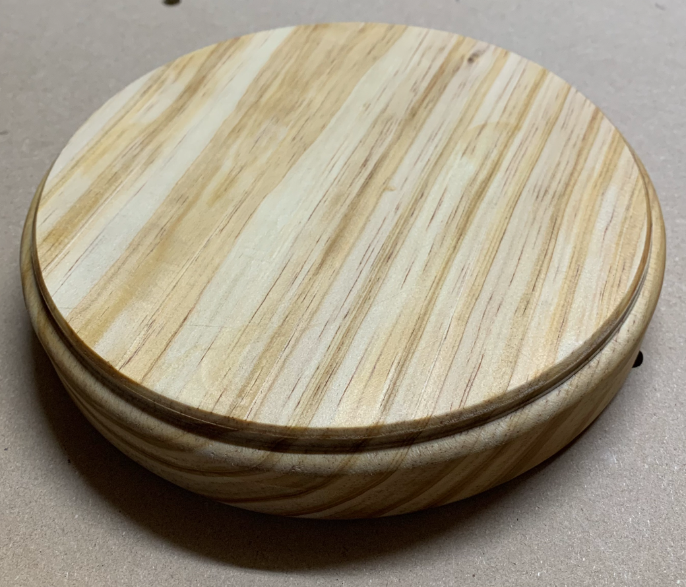
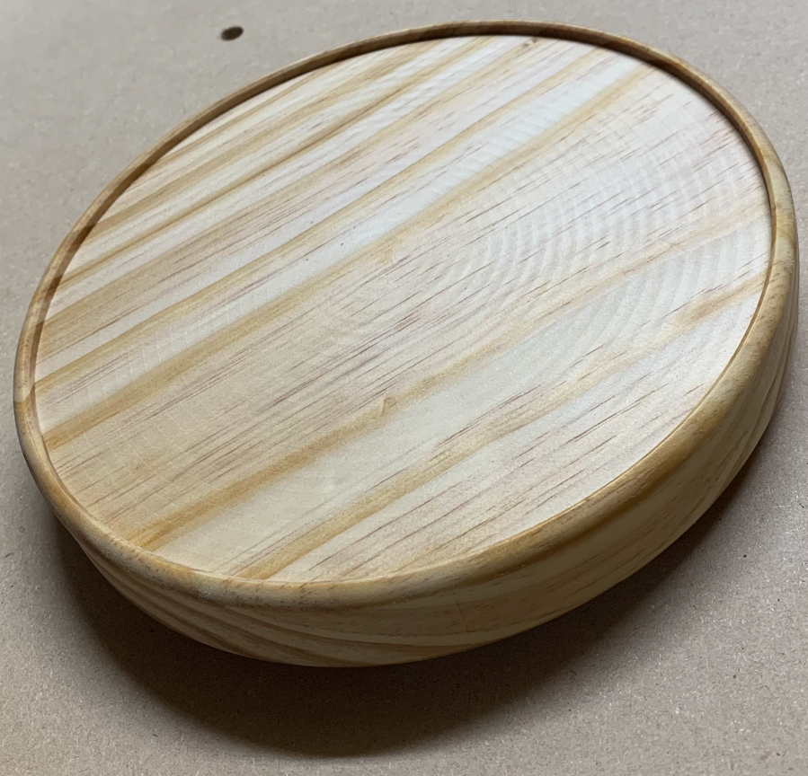
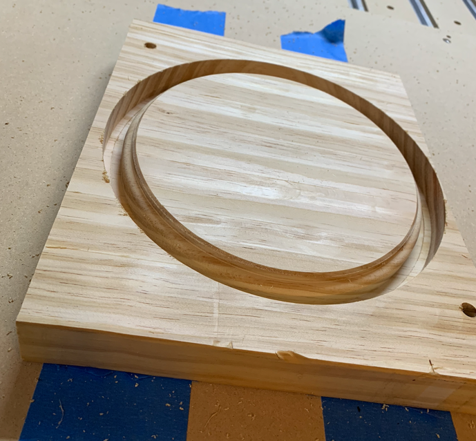
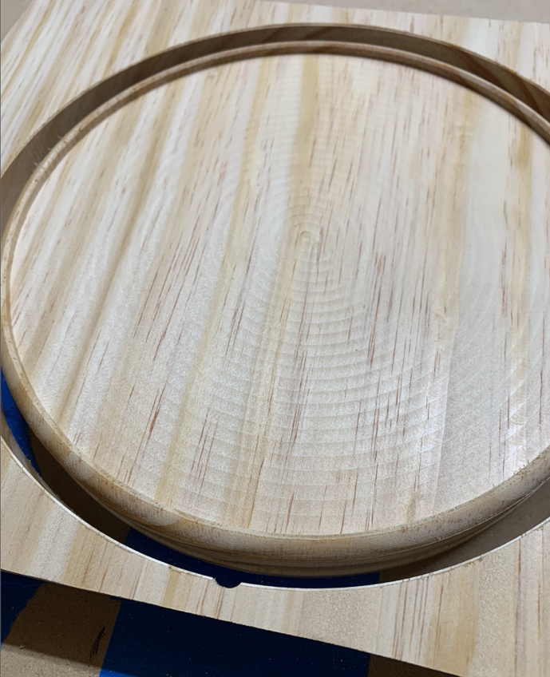
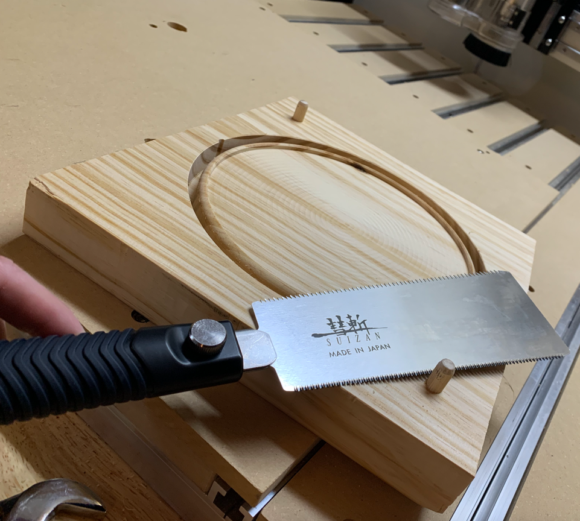
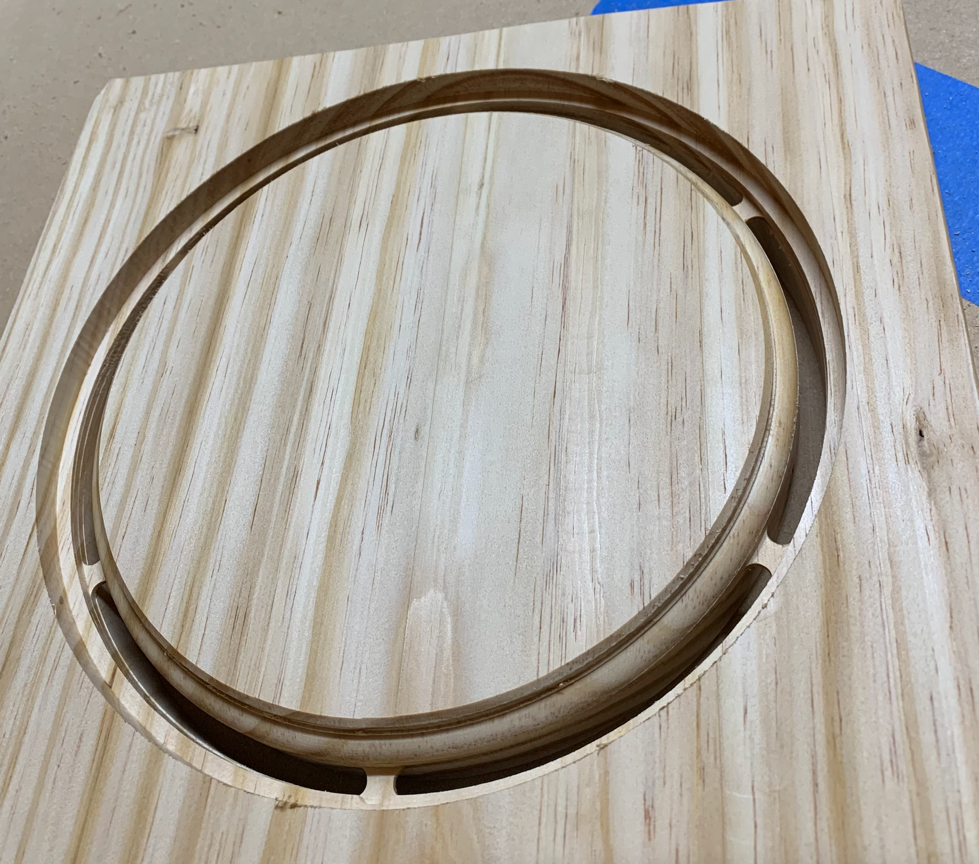

# Plant Stacker

## Key Learnings
* Tram really does matter if you are flipping parts, otherwise you get a parting line :(
* You really should surface the wasteboard because there's zero chance its flat
* Pin technique is pretty easy if you work with origin at center of part
* Japanese pull saw is very handy for cutting dowels down
* 20% of machine force and router power is way too low, 50-60% is just fine (might be able to go even higher)
* 10% of 0.001" max deflection is likely also lower than necessary (could really do 100% of whatever the max deflection actually is acceptable)
* Should optimize adaptive toolpaths based on max depth of cut to maximize MRR
* Tabs work pretty well if you can't glue down the actual work piece
* Should climb cut on finish passes
* 0.5mm or larger finish pass?
## Key Questions
* 

## Photos

